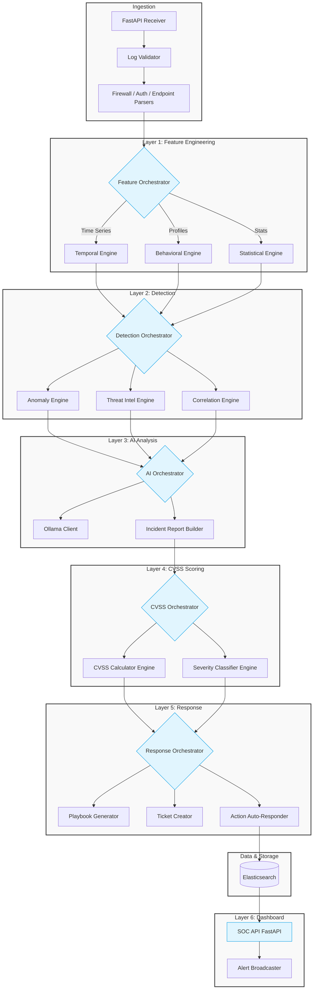

  
  <h1>tuxSOC</h1>
  
<strong>A Next-Generation Security Operations Center Pipeline</strong>

## 📌 Overview

**tuxSOC** is a modern, modular Security Operations Center (SOC) platform designed to process, analyze, and respond to security events automatically. From raw log ingestion to AI-powered analysis and automated response, tuxSOC is built to provide an end-to-end security pipeline.

## 🔄 Platform Data Flow and Architecture

The platform operates across six distinct layers, moving data from raw logs to finalized, scored security events presented on a dashboard.

## 📂 Project Structure & Module Breakdown

### 1. `main.py`
The entry point for the tuxSOC platform. Initializes the FastAPI server, connects all layers, and binds the orchestrators together.

### 2. `shared/`
Contains code utilized by multiple layers across the stack.
- `schemas.py`: Pydantic models and JSON contracts guaranteeing strict data validation between layers.
- `config.py`: Global platform configurations including port settings, confidence thresholds, API keys, and model parameters.

### 3. `ingestion/`
Handles raw data entry into the platform.
- `fastapi_receiver.py`: Hosts an endpoint taking in webhook POST requests for raw logs.
- `log_validator.py`: Basic data grooming—dropping malformed or purely noisy logs early.
- `firewall_parser.py / auth_parser.py / endpoint_parser.py`: Specialized parsers that normalize arbitrary device logs into a standard tuxSOC Event schema.

### 4. `layer_1_feature_engineering/`
Transforms normalized logs into enriched feature vectors for the detection engines.
- `feature_orchestrator.py`: Routes data to appropriate engineering sub-engines.
- **Engine 1 - Temporal**: Identifies time-series trends using `tsfresh_extractor.py` and `time_window_builder.py`.
- **Engine 2 - Behavioral**: Profiles user behavior over time (`user_profiler.py`) and detects drift (`baseline_comparator.py`).
- **Engine 3 - Statistical**: Evaluates frequency bounds (`frequency_analyzer.py`) and categorical structures (`pattern_detector.py`).

### 5. `layer_2_detection/`
Uses the engineered features to hunt for actual malice.
- `detection_orchestrator.py`: Merges findings from sub-engines to emit alerts.
- **Engine 1 - Anomaly**: Identifies outliers using machine learning (`pyod_detector.py`) and assigns risk scores via User Entity Behavior Analytics (`ueba_scorer.py`).
- **Engine 2 - Threat Intel**: Checks artifacts against known malicious databases (`ioc_matcher.py`) and assigns tactics via `mitre_mapper.py`.
- **Engine 3 - Correlation**: Groups disparate, low-severity events over a timeline to find logical attack paths (`event_linker.py`, `timeline_builder.py`).

### 6. `layer_3_ai_analysis/`
The intelligence core of the pipeline.
- `ai_orchestrator.py`: Determines which events need deep analysis.
- `ollama_client.py`: Interfaces with a local LLM running via Ollama.
- `prompt_builder.py` & `json_parser.py`: Formats logs into prompts and parses the LLM’s unstructured thought processes back into structured JSON.
- `incident_report_builder.py`: Compiles the AI’s findings into human-readable situation reports.

### 7. `layer_4_cvss/`
Objectively scores the risk of confirmed incidents.
- `cvss_orchestrator.py`: Calculates final severities.
- **Engine 1 - Scorer**: Builds CVSS vectors (`vector_builder.py`) and generates numerical 0.0-10.0 scores (`cvss_calculator.py`).
- **Engine 2 - Classifier**: Translates numerical scores into named threat priorities (Low, Medium, High, Critical) using `severity_classifier.py` and `priority_assigner.py`.

### 8. `layer_5_response/`
Handles autonomous mitigations and alerts.
- `response_orchestrator.py`: Decides what to do with a scored incident.
- `playbook_generator.py`: Generates step-by-step mitigation plans for human analysts.
- `ticket_creator.py`: Opens incidents in SOAR/ITSM systems (e.g., Jira, ServiceNow).
- **Engine 1 - Action**: Identifies auto-mitigation paths (`action_recommender.py`) and triggers immediate containment measures like firewall rule additions or account lockouts (`auto_responder.py`).

### 9. `storage/`
Data persistence layer. Operations happen here primarily at the very end of the line.
- `es_writer.py`: Pushes finalized, enriched incident objects into Elasticsearch.
- `es_reader.py`: Utility functions for the dashboard to pull metrics out of Elasticsearch.

### 10. `layer_6_dashboard/`
The graphical interface backend for SOC analysts.
- `soc_api.py`: Exposes REST endpoints for the frontend visualization layers to query event data.
- `alert_broadcaster.py`: Manages WebSocket connections to push high-severity, real-time alerts directly to analysts' screens.

---
*Built with ❤️ by the tuxSOC team.*
